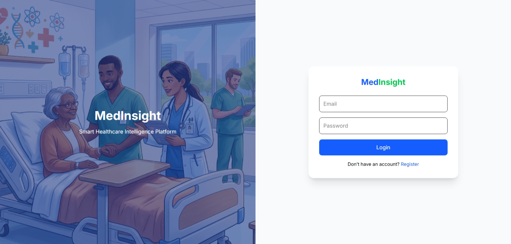

# MedInsight – Healthcare Resource & Feedback Intelligence Platform

MedInsight is a full-stack healthcare analytics platform designed to manage hospital resources efficiently and analyze patient feedback using intelligent insights.

---

##  Features

###  Authentication
- Secure user registration and login (JWT-based)
- Role-based access (Admin, Doctor, Nurse, Analyst)

###  Patient & Resource Management
- Manage hospital resources (beds, equipment)
- Track patient admissions and availability

###  Feedback System
- Patients can submit feedback
- Feedback stored and analyzed

### Analytics Dashboard (Upcoming)
- Visual insights for:
  - Resource utilization
  - Patient feedback trends
  - Hospital performance

---

##  Tech Stack

### Frontend
- React.js (Vite)
- Tailwind CSS
- Axios
- React Router

### Backend
- Node.js
- Express.js
- MongoDB (Mongoose)
- JWT Authentication
- Bcrypt (password hashing)

---

---

##  API Endpoints

### Auth Routes

| Method | Endpoint | Description |
|-------|--------|-------------|
| POST | `/api/auth/register` | Register user |
| POST | `/api/auth/login` | Login user |

---

##  Testing

Use tools like:
- Postman
- Thunder Client (VS Code)

---

##  Screenshots
Login Page

  

